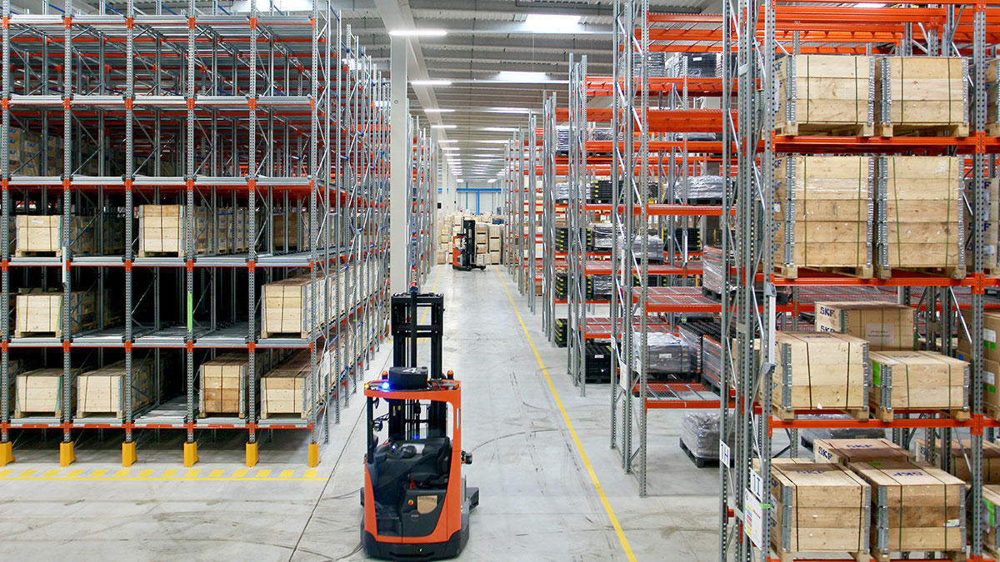
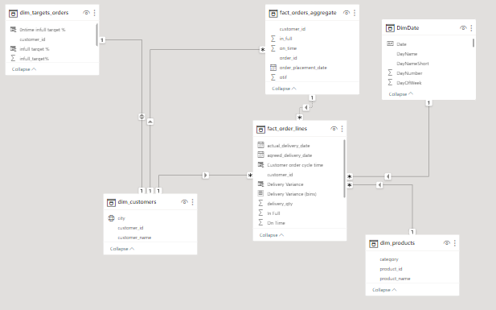
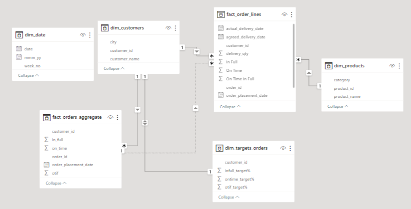
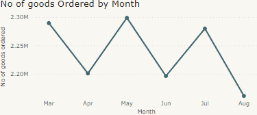
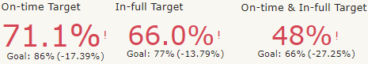
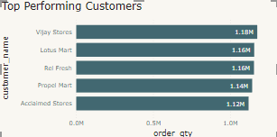
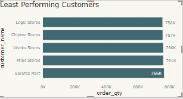
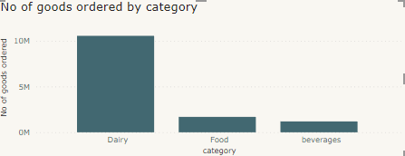
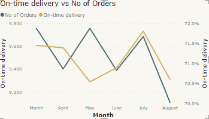
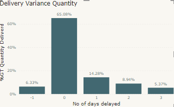

# Atliq Stores Supply Chain Analysis

## Introduction
This Power BI project focuses on analyzing the supply chain of a fictional grocery store, **Atliq Stores**, which distributes products to three different states. This project focuses on analyzing a dataset of customer orders and products in order to improve supply chain efficiency and reduce costs, by better understanding their customers, products and delivery time. and help the company make data driven decisions.

**_Disclaimer_**: All datasets and reports do not represent any company, institution or country, but just a dummy dataset to demonstrate my capabilities on power BI.

## Problem Statement
Atliq Stores is currently facing operational challenges that are hindering its supply chain efficiency and customer experience. To overcome these issues, the project focuses on harnessing the power of data analysis. By thoroughly examining customer orders and product information datasets, my aim is to uncover underlying factors impacting customer behavior, product preferences, and delivery timelines. My primary goal is to identify critical patterns, obstacles, and inefficiencies within the supply chain process. Through data-driven insights, i intend to implement strategic solutions that streamline operations, enhance cost-effectiveness, and ultimately elevate customer satisfaction.

## Skills demonstrated
The following power BI features were incoporated:
- DAX
- Quick measures
- Data modelling
- Filters
- Power query

## Data Modelling:
Automatically generated relationships are modified to eliminate undesirable connections and replace them with the necessary ones.

Adjusted Model     |     Auto Model
:------------:|:-----------:
 | 

The data model is a snowflake schema.
There are 4-dimension tables and 2 fact tables. The dimensions table are joined to the fact table with a one to many and one to one relationships.

## Visualization
The report comprises of 4 Pages
1. An Overview 
2. Customer Analysis 
3. Product Analysis
4. Delevery Analysis

You can interact with the report [here](https://app.powerbi.com/view?r=eyJrIjoiMTczYzBiOGYtZjc4NC00NGM0LWE5NjUtNjllMjUzOWJlNzY2IiwidCI6IjM3ZGNlYjFkLTdhYzMtNDA2Ny04NjJiLTU5NGQ5ZjM2MzUyMiJ9)

# Analysis
--------------

### Number of Orders each month

Sales orders followed a pattern from March to August.This repeating pattern could be due to factors like seasons or what customers prefer.

### Goal Achievement 

This analysis indicates an overallperformance shortfalls in meeting goals. Ontime delivery fell below the 86% target at 71.1%, infull fulfillment was at 66% instead of 77%, and combined ontime and infull lagged at 48% against the 66% target.

### Customer Classification

High Value Customers      |      Low Value Customers
:------------:|:-----------:
 | 

Stores like Vijay Stores and Lotus Mart place a lot of orders, around 1.16 to 1.18 million. Other stores like Logic Stores and Chipec Stores place fewer orders, around 756,000 to 766,000. To improve, we can learn from the busy stores and find ways to encourage more orders from the less busy ones.

### Category Order Count
*****

Among the different categories, diary foods stand out by securing more than 70% of the total orders. This substantial portion indicates a strong preference for diary foods compared to other categories.

### Ontime Delivery Trend
*****

When there are more orders, like in March and May, the on time delivery percentage is a bit lower. But when there are fewer orders, like in April and August, the deliveries on time are better.

### Order Delivery Timeline 
*****

The majority of orders are delivered on the expected date (65.08%). 

## Summary
*****
- Analysis were conducted for the months of March to August.
- The months of March, May, and July showed high order volumes, while April, June, and August had lower volumes.
- There's a significant disparity between top-performing and least-performing customers.
- The report highlighted the dominance of diary foods, accounting for over 50% of total orders.
- Orders were often delivered on time, but there were variations based on order quantity and timing.

## Recommendations
*****

1. Offer special discounts in months when orders are usually low, this will help increase the number of orders.
2. Engage more with both top-performing and least-performing customers to understand their needs and preferences better. Collect feedback through surveys, reviews, or direct interactions to improve overall customer satisfaction.
3. Make sure products always arrive on time by improving how things are organized and delivered.
4. Because people order a lot of dairy foods, add more kinds of dairy products to please different tastes and get more customers interested.

